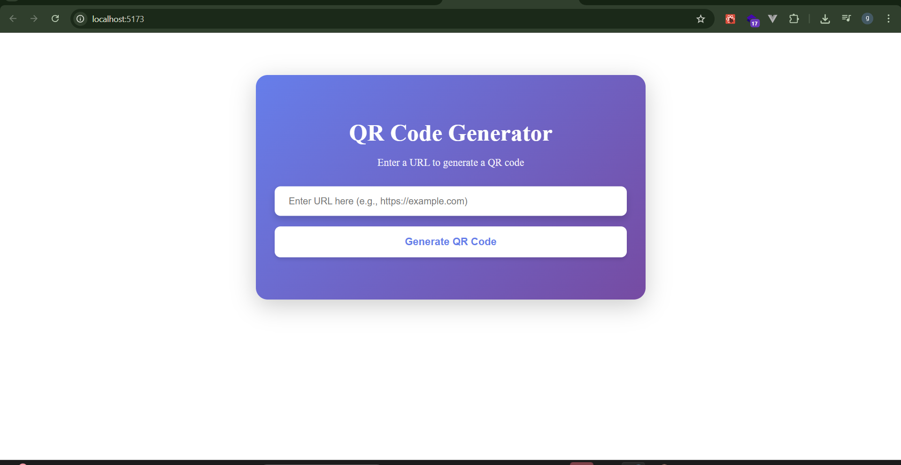
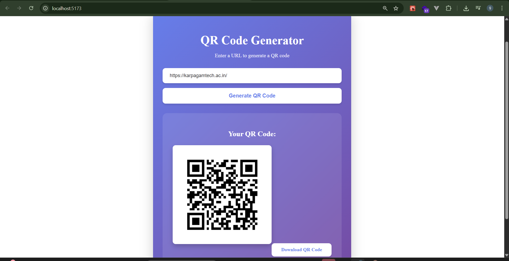

# URL to QR Generator

A full-stack QR code generator that takes a URL from a React frontend and returns a downloadable PNG QR code from a Go backend.

## Demo

### Home Screen


### Generated QR Code


## Tech Stack

- **Backend:** Go, `net/http`, `github.com/skip2/go-qrcode`
- **Frontend:** React 19, TypeScript, Vite, Axios
- **Communication:** HTTP GET with query params (`/qr?url=...`)

## Project Structure

```text
.
├── main.go                       # Go backend (QR generation API)
├── go.mod
├── go.sum
├── README.md                     # Project documentation
├── docs/
│   └── demo/
│       ├── home.png
│       └── generated-qr.png
└── qr-gen-frontend/
    ├── src/
    │   ├── App.tsx
    │   ├── App.css
    │   ├── main.tsx
    │   └── components/
    │       └── Input.tsx        # URL input + API call + download
    ├── package.json
    └── ...
```

## How It Works

1. User enters a URL in the frontend.
2. Frontend sends a request to `http://localhost:8080/qr?url=<your-url>`.
3. Backend generates a PNG QR code using `go-qrcode`.
4. Frontend renders the PNG and provides a download button.

## Backend Setup (Go)

### Prerequisites

- Go installed (project uses Go modules)

### Install dependencies

```bash
go mod tidy
```

### Run backend server

```bash
go run main.go
```

Backend starts on:

```text
http://localhost:8080
```

### API

- **Endpoint:** `GET /qr`
- **Query param:** `url` (required)
- **Success response:** `200 OK`, `image/png`
- **Example:**

```bash
curl -o qrcode.png "http://localhost:8080/qr?url=https://example.com"
```

## Frontend Setup (React + Vite)

### Prerequisites

- Node.js 18+ (recommended)
- npm

### Install dependencies

```bash
cd qr-gen-frontend
npm install
```

### Start development server

```bash
npm run dev
```

Frontend runs on Vite default URL (usually):

```text
http://localhost:5173
```

## Run Full App Locally

Use two terminals:

### Terminal 1 (backend)

```bash
go run main.go
```

### Terminal 2 (frontend)

```bash
cd qr-gen-frontend
npm install
npm run dev
```

Open the frontend URL, enter any valid URL, and click **Generate QR Code**.

## Available Frontend Scripts

Inside `qr-gen-frontend`:

- `npm run dev` – start dev server
- `npm run build` – type-check + production build
- `npm run preview` – preview production build
- `npm run lint` – run ESLint

## Notes

- CORS is enabled in the backend for local frontend-backend communication.
- The frontend currently targets backend URL `http://localhost:8080` directly.
- Pressing **Enter** in the input also triggers QR generation.
